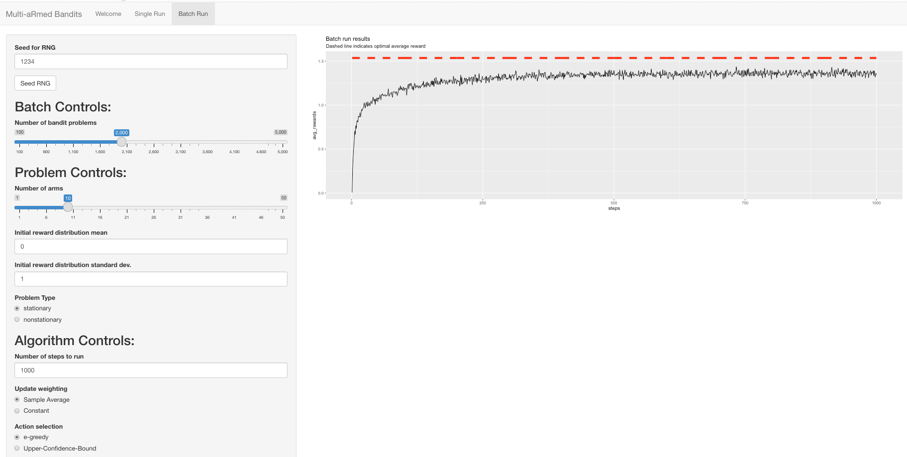

# Multi-aRmed Bandits
## Author: Daniel Mallia

This project implements in R (hence the name) some of the bandit problem aspects and algorithms for
learning bandit problems (listed below), as described in Chapter 2 of Richard Sutton and Andrew
Barto's "Reinforcement Learning" (2nd ed.).
Moreover, this project offers a `shiny` test interface for conducting experiments with different bandit problem and learning algorithm configurations.
A sample of the interface being used to recreate one of the evaluations from the book (page 29) can be found below:




## Components implemented:
- Stationary and non-stationary bandit problems with accompanying visualizations
- The "simple bandit algorithm" with the ability to use different:
  - estimate update weights
  - action selection methods
  - optimistic initial values
- Plotting of bandit algorithm performance

## Requirements and run instructions:
This demo requires the `shiny` and `ggplot2` packages, both of which may be installed in an R session with:
```
install.packages(c("shiny","ggplot2"))
```

Then the app may be run from RStudio or via an R session with:
```
library(shiny)
runApp("app.R")
```

